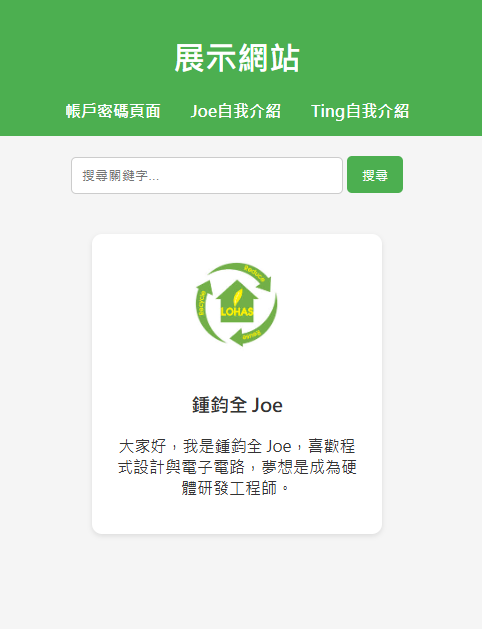
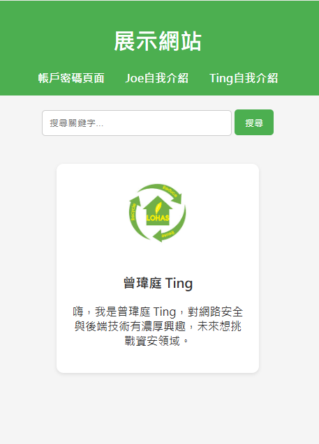

# 網站說明

  

---

## 一般資訊

* **網站名稱**：新員工自我介紹
* **官方網址**：[https://你的網站網址.com](https://你的網站網址.com)
* **GitHub 原始碼**：[https://github.com/你的帳號/你的專案](https://github.com/你的帳號/你的專案)
* **使用說明文件**：[https://你的網站網址.com/docs](https://你的網站網址.com/docs)
* **討論區 / 聯絡方式**：[https://你的網站網址.com/forum](https://你的網站網址.com/forum)

---

## 功能特色

* 使用者登入與管理
* 搜尋功能，可快速找到內容
* 自我介紹頁面，支持多用戶

---

### 使用網站

* 登入帳號
* 使用搜尋功能快速找到內容
* 點擊使用者名稱查看自我介紹

---

## 文件與幫助

* 線上文件：[https://你的網站網址.com/docs](https://你的網站網址.com/docs)
* 支援格式：HTML、PDF、Markdown
* 文件內容：

  * 安裝指南
  * 功能說明
  * API 使用方法
  * 使用範例與截圖

---

## 截圖範例

### 登入畫面

1.[登入畫面](https://joe1025555.github.io/#login)

### Joe自我介紹

2.[Joe自我介紹](https://joe1025555.github.io/#joe)

### Ting自我介紹

3.[Ting自我介紹](https://joe1025555.github.io/#ting)

---

## 版權與授權資訊

* 版權所有 © 2025 Joe&Ting
* 授權方式：MIT License，可用於商業或個人專案
* 所有商標與圖片屬其各自持有人所有

---

## 聯絡方式

* 電子郵件：[Joe@3rgit.com.tw](mailto:Joe@3rgit.com.tw)

* 電子郵件：[Ting@3rgit.com.tw](mailto:Ting@3rgit.com.tw)

---